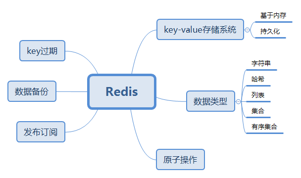

## Redis

### 1.概述

### 2.例子

#### 2.1 从第三方接收数据

问题描述：A系统将处理好的数据存储到redis中(A系统为第三方)，B系统从redis取出数据来处理

### 3.原理

#### 3.1 发布订阅的原理

频道发布订阅：在服务器端保存订阅关系，pubsub_channels。它是一个字典，键为某个被订阅的频道，值是一个链表。

模式的发布与订阅：在服务器pubsub_patterns链表中保存所有模式的订阅关系。链表的每个节点包含着一个pubsubPattern结构，这个结构的pattern属性记录了被订阅的模式，而client属性记录了订阅模式的客户端。

发送消息：

将消息message发送给channel频道的所有订阅者；如果一个或多个模式pattern与频道channel相匹配，那么将message发送给pattern模式的订阅者。

**缺点** ：对旧版本Redis来说，如果一个客户端订阅了某个或某些频道，但它读取消息的速度快不够快的话，那么不断积压的消息就会使得Redis输出缓冲区的体积变得越来越大，这会导致Redis速度变慢，甚至直接崩溃。新版会自动断开不符合client-output-buffer-limit pubsub配置选项要求的订阅客户端。

客户端丢失在断线期间发送的所有消息。

### 4.面试题

#### 4.1 什么是redis，简述优缺点

概述+例子+缺点

List来做FIFO双向链表，实现一个轻量级的高性能消息队列服务；

Set，高性能tag系统；

key-value设置过期时间，加强版的memcached；

缺点：数据库容量受到物理内存的限制

#### 2.redis相比memcached有哪些优势

memcached所有值都是简单的字符串，redis丰富数据类型；

redis速度比memcached快；

redis可以持久化数据

#### 3.Redis有哪几种数据淘汰策略？

#### 4.一个字符串类型的值能存储的最大容量是多少？

512M

#### 5.Redis有哪些适合的场景？

### 参考链接

1. Reids面试题目

   <https://www.cnblogs.com/lfs2640666960/p/9700706.html>

   